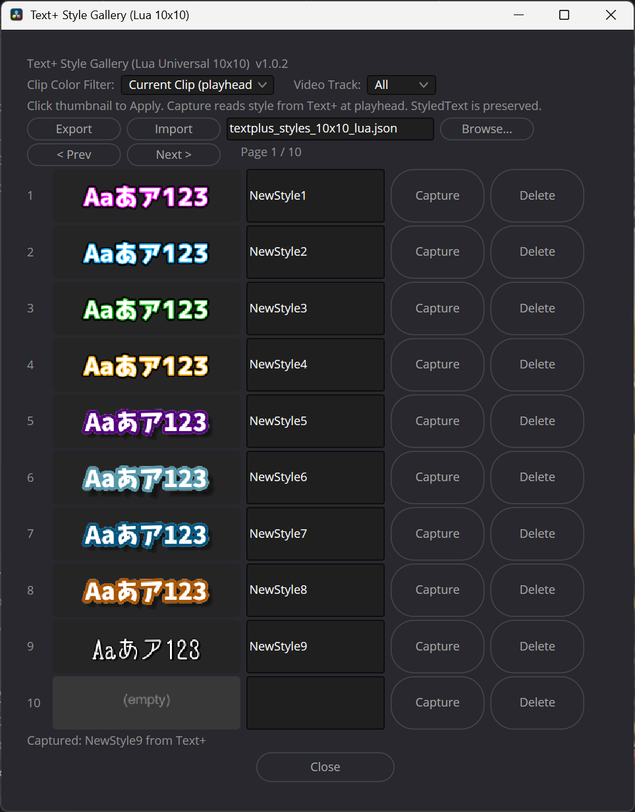

# Text+ Style Gallery for DaVinci Resolve



Text+ styles can be captured, previewed as thumbnails, and applied with a single click.

A lightweight **native Lua style gallery for Text+** in DaVinci Resolve / Fusion.

Save frequently used Text+ looks, preview them as thumbnails, and apply them to other Text+ clips without replacing the actual text content.

**Version:** 1.0.0  
**Release date:** 2026-09-04

## Features

- 100 style slots: **10 pages × 10 slots**
- Capture a style from the Text+ clip at the playhead
- Apply a saved style by clicking its thumbnail
- Preserves `StyledText`, so the destination clip's actual text is not replaced
- Apply to the current clip or filter targets by video track / clip color
- Multiple Text+ **Shading Elements** supported, including fill, outlines and shadows
- SVG thumbnail previews generated directly in Lua
- No Python or Pillow dependency
- Import / Export of the style library as JSON
- Per-user writable data folder
- Fast Prev / Next paging without rebuilding the window
- Mixed Latin/Japanese preview text: `Aaあア123`

## Installation

Download `TextPlus_Style_Gallery.lua` from the latest GitHub Release.

### Windows

Copy `TextPlus_Style_Gallery.lua` to the following folder:

```text
%APPDATA%\Blackmagic Design\DaVinci Resolve\Support\Fusion\Scripts\Utility\
```

You can paste the path above directly into the Windows File Explorer address bar.

If the `Utility` folder does not exist, create it.

### macOS

Copy `TextPlus_Style_Gallery.lua` to the following folder:

```text
~/Library/Application Support/Blackmagic Design/DaVinci Resolve/Fusion/Scripts/Utility/
```

If the `Utility` folder does not exist, create it.

### After installation

1. Restart DaVinci Resolve if it is already running.
2. Open DaVinci Resolve and load your project.
3. Make sure the project contains a **Text+** title.
4. Open **Workspace > Scripts** from the DaVinci Resolve menu.
5. Select **TextPlus_Style_Gallery**.

The **Text+ Style Gallery** window should appear.

> **Note:** The exact script location or menu structure may vary depending on your DaVinci Resolve version and installation.

## Basic usage

1. Put the playhead over a Text+ clip whose style you want to save.
2. Open **Text+ Style Gallery**.
3. Choose an empty slot and click **Capture**.
4. Enter or edit the style name if desired.
5. Move the playhead to another Text+ clip.
6. Click the saved thumbnail to apply the style.
7. Use **Prev / Next** to move through the 10 pages.

The script preserves the destination Text+ clip's `StyledText` while applying the saved style.

## Target filters

The controls at the top of the gallery can limit operations by **Clip Color** and **Video Track**. Use these carefully when applying a style to more than the current clip.

## Style data

The gallery stores its working library in a per-user writable data directory. The default Lua library filename is:

```text
textplus_styles_10x10_lua.json
```

Use **Export** before moving machines or making major changes. Use **Import** to load a previously exported library.

## Thumbnail preview

Thumbnail previews use:

```text
Aaあア123
```

This intentionally combines Latin letters, Japanese hiragana/katakana and numbers so both Latin and Japanese font styles are easier to distinguish. On systems without Japanese glyph support, those glyphs may be rendered with a fallback font; this does not affect style application.

## Notes and limitations

- This is a native Lua script intended for DaVinci Resolve / Fusion's scripting environment.
- Complex Fusion objects such as Expressions, Modifiers, Splines and Gradient objects are intentionally not serialized as ordinary style values.
- Thumbnail rendering is an approximation of Resolve's Text+ renderer. SVG previews are intended for identifying styles, not pixel-perfect reproduction.
- SVG thumbnail display depends on the Qt image support bundled with DaVinci Resolve.
- Keep a backup/export of important style libraries.

## License

Released under the **MIT License**. See `LICENSE`.

## Release

The first public release is **v1.0.0**. Internal development builds leading to this release used different version numbers; the public version starts at v1.0.0.
